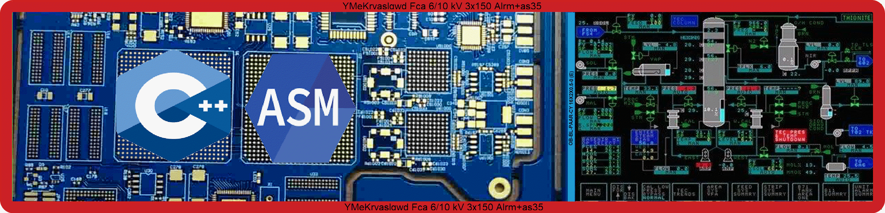
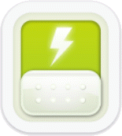
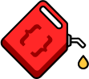
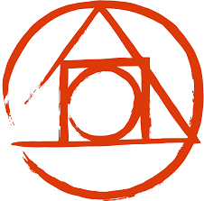

# Tech Stack:

> ## Programming Languages:
> 

> ## Databases:
> 

> ## Toolset:
> 

> ### Front-End Frameworks:
> 

> ### Back-End Frameworks:
> 
> ### Test Frameworks:
> 

> ### Monorepos:
> 
> ### Security:
> 

> ### Styleguides:
> 

> ### Version Control Systems:
> 

> ### Package Managers:
> 

> ### Graphic Tools:
> 

> ### Hosting Providers:
> 

